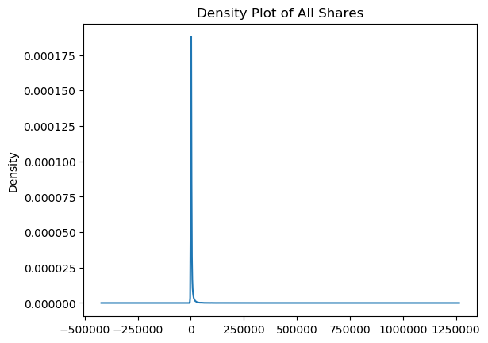
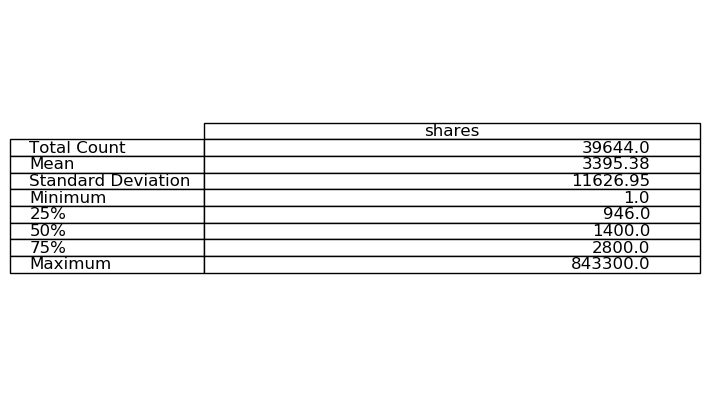
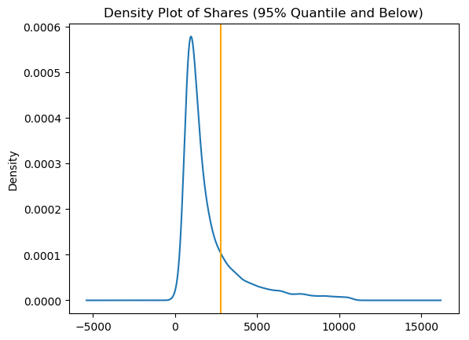
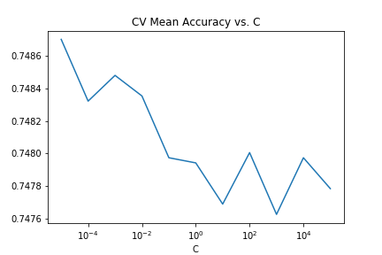
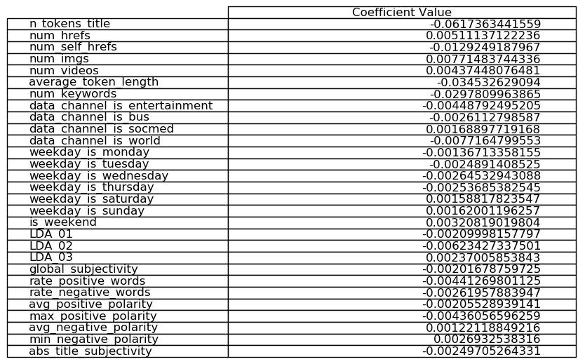

### Overview

The data set [here](http://archive.ics.uci.edu/ml/datasets/Online+News+Popularity) contains information on articles posted on Mashable as well as the number of shares they received via social media. There are 61 features in the data set -- this includes the response `shares` as well the URL to the article and the time between the article's posting and when the data was found, both of which are metadata for the study the data was used in and are irrelevant to the response. After cleaning then, there are 58 predictors and one response. A full list of the predictors and what they measure can be found on the website the data was taken from. There are 39644 observations in the data set. The goal of the analysis is to predict whether or not an article will be popular and which features are most relevant to an article's popularity.

The first issue is of course what it means for an article to be popular. The distribution of the shares is incredibly right-skewed. We can see it from the below image,

It's even more evident from the summary statistics,

where we can see the effect that a handful of outlier articles are having on the mean. With this in mind, the mean isn't a good benchmark to compare against to classify popularity. Instead, we can define popularity relative to quantiles -- we'll consider any article in the 75th-percentile (i.e. with shares above 2800) as being popular. Filtering out articles in the 95th percentile of shares, we can see where this benchmark lies,

### Analysis

Our analysis has two goals:

1. To be able to accurately predict the popularity of an article.
2. To identify the features most relevant to the popularity of an article.

 We're trying to predict the likelihood that a given article will surpass the 2800 article threshold. To classify new articles using the model, we'll predict that any article with a probability of at least 0.5 will be popular.

First, the data was randomnly split into a training and test set. The test set contained 20% of the observations. The model we fit used L2-regularized logistic regression along with recursive feature elimination for the actual feature selection.

To choose the regularizer weight `C` used in the model, I used cross-validated and scored on accuracy. Powers of 10 were tested, ranging from 10^-5 to 10^5. In the end though, the accuracy varied very little between the tested values,

Note here that C is inversely proportional to the actual magnitude of the constant, so a larger constant actually scored a higher accuracy.

Fitting the model with the optimal value of C, we get only 29 features used in the logistic regression -- half the number of features that we started with. The ones found are in the table below,

There are a few things of note we can take from this. For one, no feature actually has that strong of predictive power. Of the coefficients, four are an order of magnitude larger than the others:

- `n_tokens_title`: The number of words in the title.
- `num_self_hrefs`: The number of links in the article to other Mashable content.
- `average_token_length`: The average length of the words in the content.
- `num_keywords`: Number of keywords the article is tagged with.

All of these were negatively associated with a high probability of being popular, according to our model. This suggest that if you want to write a popular article, you should have a short title, use short words in the article, tag it with only a few keywords, and and don't link to other Mashable content.

From the other features, other patterns can be discerned. For example, articles posted on weekends are more likely to be popular, and the most popular articles seem to be those posted in the Social Media channel on Mashable.

Finally, in terms of the model performance on the test set, running the model on the test set gives an accuracy of approximately 74.56%. Considerably better  than chance, though not perfect.
